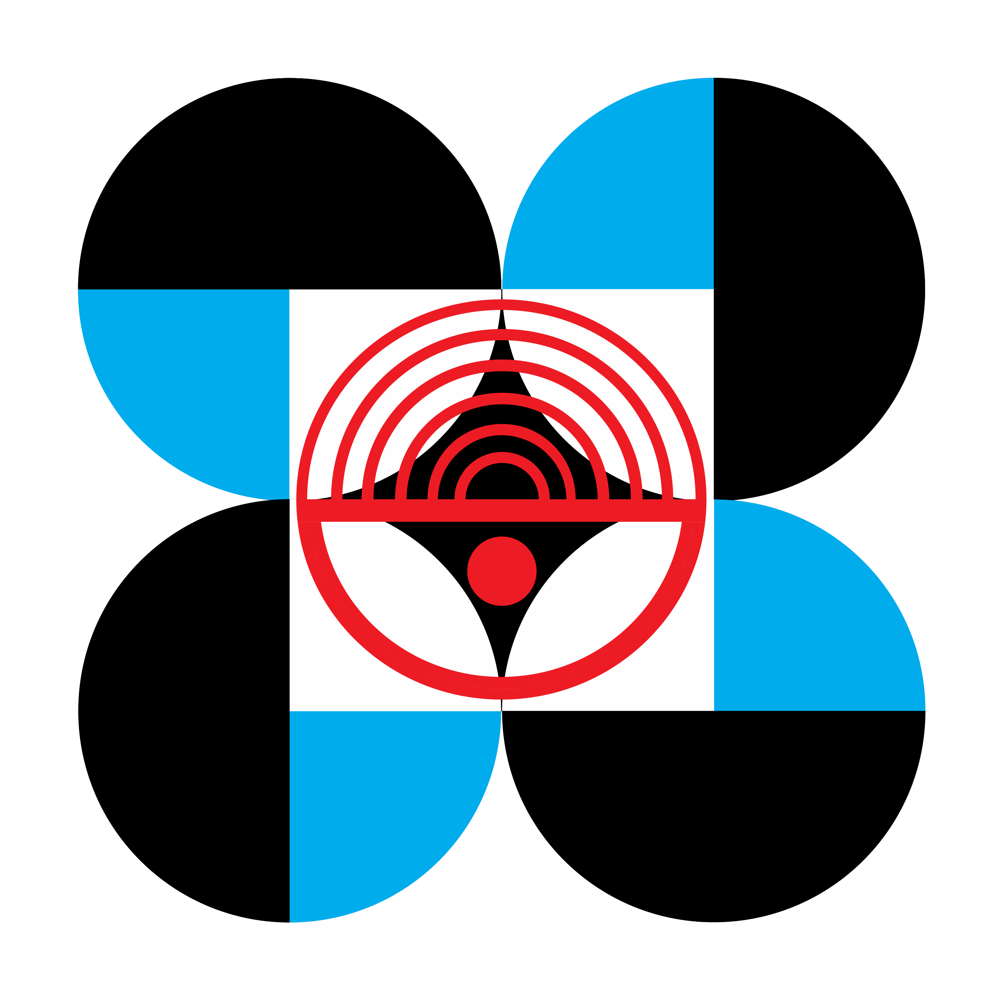

<div align="center">

<!-- STII Logo Placeholder – replace with the official STII banner/logo if available -->


# DOST – STII Tech Resource Blog

**Department of Science and Technology · Science and Technology Information Institute**

A modern Astro-powered technical resource hub for DOST–STII featuring GPU and RAM references, hardware troubleshooting guides, and system specification recommendations.

**Maintained by Azzurra56 · IT Support Intern**

*By 2040, we are the lead agency in Science, Technology and Innovation Information.*

[](https://astro.build)
[](https://developer.mozilla.org/en-US/docs/Web/JavaScript)
[](https://tailwindcss.com)
[](https://opensource.org/licenses/ISC)
[](https://nodejs.org)

</div>

---

## 📋 Table of Contents

- [About the Project](#-about-the-project)
- [Key Features](#-key-features)
- [Tech Stack](#-tech-stack)
- [Project Structure](#-project-structure)
- [Getting Started](#-getting-started)
- [Available Scripts](#-available-scripts)
- [Deployment](#-deployment)
- [Contributing](#-contributing)
- [License](#-license)
- [Contact](#-contact)

---

## 🏛️ About the Project

This repository hosts a modern, fast web application built for the **Science and Technology Information Institute (STII)** under the **Department of Science and Technology (DOST)** of the Philippines.

The site serves as a technical reference hub covering:

- Graphics card (GPU) specifications and a visual gallery
- RAM module information and comparisons
- Frequently encountered hardware issues and their solutions
- Motherboard diagnostic beep code reference
- Hardware combo / system specification recommendations
- Organizational information — mission, vision, and key statistics

The platform is designed to support STII's mandate of providing accessible, reliable science and technology information resources to researchers, educators, and the general public.

---

## ✨ Key Features

| Feature | Description |
|---|---|
| 🖼️ **GPU Gallery** | Interactive gallery of NVIDIA RTX cards with full-screen modal viewer, keyboard navigation, and swipe support |
| 🧠 **RAM Reference** | Detailed RAM module specifications and memory configurations |
| 🐛 **Known Issues Tracker** | Curated list of common GPU/hardware issues with step-by-step solutions |
| 🔊 **Beep Code Reference** | Motherboard POST beep code lookup for common BIOS manufacturers |
| ⚙️ **Specs & Combos** | Recommended hardware combinations and system specifications |
| 📞 **Contact Page** | Easy-to-find STII contact information |
| 📖 **About Page** | STII mission, vision, and key metrics (STARBOOKS deployments, journal titles) |
| 📱 **Responsive Design** | Mobile-first layout with hamburger navigation menu |

---

## 🛠️ Tech Stack

| Technology | Version | Role |
|---|---|---|
| [Astro](https://astro.build) | `^5.18.0` | Core framework – static site generation |
| CSS3 | — | Scoped component and global styles |
| JavaScript (ES2022) | — | Interactive UI (galleries, modals, navigation) |
| [Bootstrap Icons](https://icons.getbootstrap.com) | CDN | Navigation and UI icons |
| [Bootstrap](https://getbootstrap.com) | CDN | Supplementary layout utilities |

> **Language composition:** Astro 51.8% · CSS 46.5% · JavaScript 1.7%

---

## 📁 Project Structure

```
blog/
├── public/                   # Static assets served at root
│   ├── STII.png              # STII organizational logo
│   ├── AstroJs/              # Astro framework assets
│   ├── bootstrap-icons/      # Icon library assets
│   └── robots.txt
├── src/
│   ├── assets/               # Image assets (GPU, RAM photos)
│   │   ├── 3050.jpg
│   │   ├── 3060.png
│   │   ├── 3070.jpg
│   │   ├── 3080.png
│   │   ├── 5060.jpg
│   │   ├── 5070.jpg
│   │   ├── 16gb.jpg
│   │   ├── 8gb.jpg
│   │   └── ram.png
│   ├── components/
│   │   └── Header.astro      # Shared site header & navigation
│   ├── data/
│   │   ├── beepCodes.json    # Motherboard beep code definitions
│   │   └── issues.json       # Known hardware issues & solutions
│   ├── pages/                # File-based routing (one file = one route)
│   │   ├── index.astro       # Home – GPU gallery
│   │   ├── ram.astro         # RAM specifications
│   │   ├── spec.astro        # Hardware specs & combos
│   │   ├── issues.astro      # Known issues tracker
│   │   ├── Beep.astro        # Beep code reference
│   │   ├── contact.astro     # Contact information
│   │   └── about.astro       # About DOST–STII
│   ├── styles/               # Page-scoped and global CSS
│   │   ├── global.css
│   │   ├── Image.css
│   │   ├── about.css
│   │   ├── beep.css
│   │   ├── contact.css
│   │   ├── issue.css
│   │   └── ram.css
│   └── env.d.ts              # TypeScript environment types
├── astro.config.mjs          # Astro configuration
├── tsconfig.json             # TypeScript configuration
└── package.json
```

---

## 🚀 Getting Started

### Prerequisites

- [Node.js](https://nodejs.org) **v18.17.1** or higher
- [npm](https://www.npmjs.com) (included with Node.js)

### Installation

```bash
# 1. Clone the repository
git clone https://github.com/Azzurra56/blog.git
cd blog

# 2. Install dependencies
npm install

# 3. Start the development server
npm run dev
```

The development server will start at **`http://localhost:4321`** (also accessible on all network interfaces for local network testing).

---

## 📜 Available Scripts

| Command | Description |
|---|---|
| `npm run dev` | Start local development server at `localhost:4321` |
| `npm run build` | Build the production-ready static site into `./dist/` |
| `npm run preview` | Preview the production build locally before deploying |

---

## 🌐 Deployment

This project generates a fully static site via `npm run build`, producing a `./dist/` directory that can be deployed to **any static hosting provider**.

### General Steps

```bash
# 1. Build the project
npm run build

# 2. Deploy the contents of ./dist/ to your hosting provider
```

### Compatible Platforms

| Platform | Notes |
|---|---|
| [Vercel](https://vercel.com) | Zero-config Astro support |
| [Netlify](https://netlify.com) | Drag-and-drop or Git-connected deploy |
| [GitHub Pages](https://pages.github.com) | Requires setting `base` in `astro.config.mjs` |
| [Cloudflare Pages](https://pages.cloudflare.com) | Build command: `npm run build`, output: `dist` |
| Any static file server | Upload `./dist/` contents directly |

> ℹ️ For GitHub Pages deployment, update `astro.config.mjs` to add your `base` path. See the [Astro deployment guide](https://docs.astro.build/en/guides/deploy/) for platform-specific instructions.

---

## 🤝 Contributing

Contributions are welcome! To maintain quality and consistency, please follow these steps:

1. **Fork** the repository
2. **Create** a feature branch: `git checkout -b feature/your-feature-name`
3. **Commit** your changes with a clear message: `git commit -m 'Add: brief description'`
4. **Push** to your branch: `git push origin feature/your-feature-name`
5. **Open a Pull Request** describing your changes

### Guidelines

- Follow the existing Astro component and CSS file conventions
- Test your changes locally with `npm run dev` before submitting
- Keep data in `src/data/` accurate and verifiable
- Please read our [Code of Conduct](CODE_OF_CONDUCT.md) *(placeholder – add when available)*

---

## 📄 License

This project is licensed under the **ISC License**.

```
ISC License

Copyright (c) 2024 DOST–STII

Permission to use, copy, modify, and/or distribute this software for any purpose
with or without fee is hereby granted, provided that the above copyright notice
and this permission notice appear in all copies.
```

See the [ISC License details](https://opensource.org/licenses/ISC) for more information.

> ⚠️ **Warning:** This repository is intended for DOST-STII internal use only. Unauthorized use by non-DOST-STII personnel may result in administrative or legal consequences.

---

## 📬 Contact

**Science and Technology Information Institute (STII)**
Department of Science and Technology (DOST)
Philippines

- 🌐 Website: [stii.dost.gov.ph](https://stii.dost.gov.ph)
- 📧 For project-related queries, open an [issue](https://github.com/Azzurra56/blog/issues) on this repository

---

<div align="center">

*Built with ❤️ for science and technology information access in the Philippines.*

[](https://astro.build)

</div>
